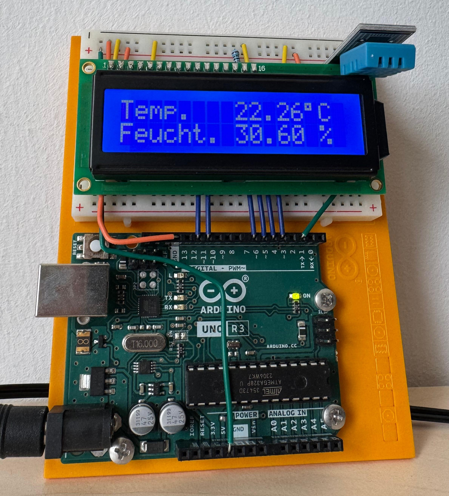
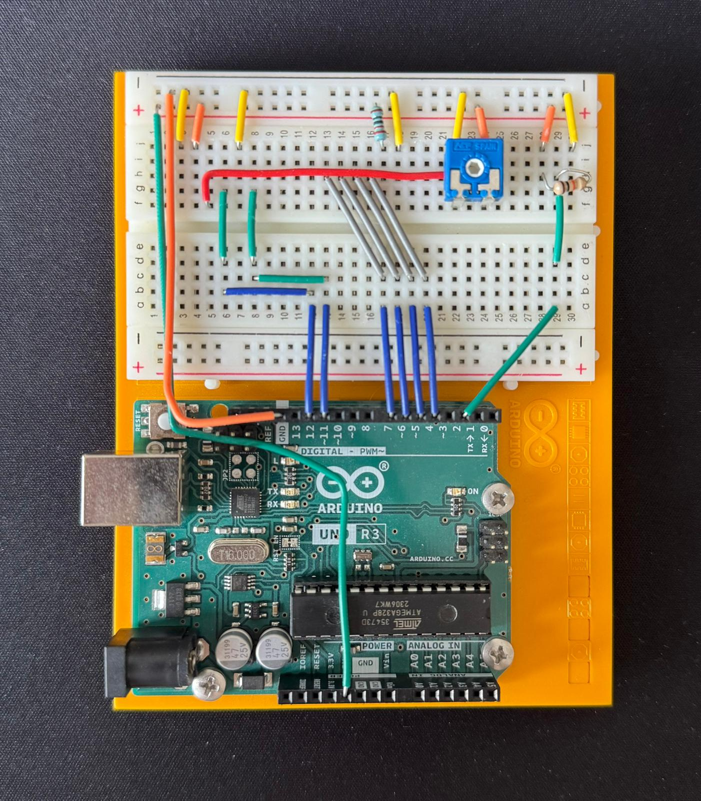

# Arduino Weather Station 🌤️

A simple, Arduino-based weather station that measures temperature and humidity, displaying the real-time data on an LCD screen. This project demonstrates basic hardware interfacing, sensor data reading, and external display control in C++.

## 📌 Features
* **Real-Time Measurement:** Continuously reads the current temperature in Celsius and humidity.
* **LCD Output:** Displays the readings clearly on a 16x2 character LCD.
* **Heat Index Calculation:** The code includes the logic to compute the heat index in Celsius based on the current environmental data.
* **Error Handling:** The system detects failed sensor readings and outputs a "SENSOR READ FAILED!" error message on the display before trying again.

## 🛠️ Hardware Used
* Arduino Uno R3
* DHT11 Temperature and Humidity Sensor 
* 16x2 LCD Display (HD44780 compatible) 
* 10kΩ Potentiometer (for LCD contrast adjustment)
* Resistor (for LCD backlight)
* Breadboard & Jumper wires

## 🔌 Wiring & Pinout
The connections between the Arduino and the components are configured as follows:

**LCD Display:**
* RS -> Digital Pin 12 
* EN -> Digital Pin 11 
* D4 -> Digital Pin 7 
* D5 -> Digital Pin 6 
* D6 -> Digital Pin 5 
* D7 -> Digital Pin 4 

**DHT11 Sensor:**
* Data Pin -> Digital Pin 2 

## 💻 Software & Libraries
To run this code, the following libraries must be installed in the Arduino IDE:
* `DHT.h` (Adafruit DHT sensor library) 
* `LiquidCrystal.h` (Standard Arduino library) 

## 🚀 Installation & Usage
1. Build the circuit according to the wiring list above. Check the images below for reference.
2. Open the `WeatherStation.ino` file in your Arduino IDE.
3. Ensure the required libraries are installed.
4. Connect the Arduino to your computer via USB.
5. Select the correct board (Arduino Uno) and COM port in the IDE.
6. Upload the sketch. After a brief boot screen showing "Temperatur & Luftfeuchtigkeit" , the display will update with the current readings every 5 seconds.

## 📸 Gallery

### Operating Device

### Wiring Setup
